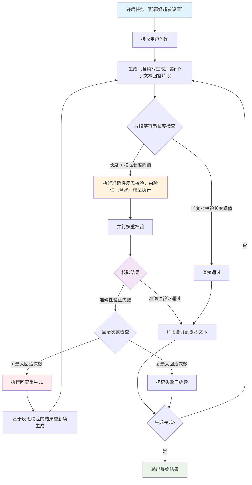

## 背景

这两天，关于**GPT-5**的消息越来越热闹了（8月份大概率要发布了）。

据传这次 GPT-5 的「疑似王牌」之一即是：**通用验证器**（universal verifier）。相关信息可以参看[机器之心关于GPT-5推文](https://mp.weixin.qq.com/s/IkaZupR4PXC5rxIAYijlhA)。

其**通用验证器**（universal verifier）的核心概念可以阅读[Prover-Verifier Games improve legibility of LLM outputs](https://arxiv.org/pdf/2407.13692)这篇论文，其核心思想是：

【让**验证器**（或称**监督器**）来为**证明器**（或称**生成器**）大模型的推理链打分，并将其作为奖励信号反馈给大模型进行策略更新】

> 其中，为了验证器的推理效率，**验证器**（或称监督器）是一个专门训练的**小模型**

正好博主最近一年也有实践**添加验证器（监督器）**以用于提升大模型回答的**准确性**和**可解释性**，并**降低大模型幻觉**，并取得了实测不错的效果，故此分享出来~

---

## 1、引言

我们知道，大语言模型是一个**快系统**（作为对比的，AlphaGO是一个慢系统）

>
>图示来源: [andrej karpathy演讲](https://karpathy.ai/stateofgpt.pdf)

**快系统弊端**：大语言模型可能在某一个token采样时不够走运（采样到一个不太好的token），然后就“多米诺效应”地让接下来的token采样沿着“死胡同”走下去（注意力机制，每个token采样都被前序token采样结果所困），最后导致模型回复效果不好；与人显著不同的是，人可以中止或者从坏的采样中恢复，但语言模型只会继续这个自回归生成序列（即使它知道这个序列效果不好）；人必须提示它做检查（重新回复），它才会纠正错误，重新生成；

> **快系统评价**：**大模型只有前进档**，于任务解决过程中，只是延续`predict next token`的范式执行任务，其显著区别于`人的元认知能力`：能够在**推理过程中随时停止**（**刹车功能**）并**执行反思校验**，反思校验判断存在问题的话还会及时回滚至上一状态（**倒车档**，对于大模型来说即从第`n`个片段回滚至第`n-1`个片段的结尾）继续续写（同时会结合反思校验的评估反馈进行续写，即对应于强化学习里的将奖励信号反馈给大模型后进行策略更新）。

我们要做的范式改变就是：**为其在输出过程中实施过程监督（大白话就是为其推理过程，添加反思校验环节）**；

> 注意！**不是由生成模型自反思、自监督（验证）**，而是引入一个新模型——监督模型或称验证（校验）模型执行反思校验

其对生成过程中的每段输出文本执行验证任务（比如判断该段回答是否正确（**正确性**）、是否价值观正确、rag场景下判断这段文本引用了哪篇参考资料（**可解释性**）等），如果判断为有误，那么这段输出的文本就被舍弃掉，回滚至上一状态重新这个自回归生成任务（结合反思校验续生成）。

其**显著不同于结果监督**，**过程监督**VS**结果监督**的介绍和区别可以总结如下：

- 过程监督：过程监督更侧重于模型生成推理过程的正确性和合理性，不仅需要正确的最终答案，每一步的推理步骤也需要受到监督和评估。
- 结果监督：主要关注模型最终输出的正确性，根据最终答案是否与标准答案一致来获得奖励或惩罚；易于实施。

结果监督的主要问题：
- 可能通过错误推理得到正确答案
- "对齐问题"或"奖励黑客"

过程监督的优势：
- 提供更精细的反馈信号
- 指出错误发生的具体位置
- 引导学习正确的推理模式

过程监督的弊端：
- 实施困难，难量化每一步的奖励评分


| 特性       | 过程监督                     | 结果监督                   |
|------------|------------------------------|----------------------------|
| 反馈对象   | 推理过程中的每一个中间步骤   | 最终输出结果               |
| 监督粒度   | 细粒度，对每一步进行评价     | 粗粒度，仅对最终结果进行评价 |
| 数据需求   | 需要大量高质量的步骤级标注数据 | 仅需最终结果的标注           |
| 对齐影响   | 直接奖励对齐的思维过程       | 可能奖励未对齐的过程         |


>还里有一个简单的例子代入理解**结果监督**和**过程监督**的区别，请参看这份提示词(来自[宝玉老师](https://baoyu.io/blog/prompt-engineering/translator-gpt-prompt-v2))：
>[翻译任务之直译+反思+意译工作流](https://kimi.moonshot.cn/share/ct2jtqh1jfdahgsa6mpg)；
>该工作流就是一个典型的**结果监督**（直译完了然后**整体**进行反思）
>如果是**过程监督**的话，**应该是在直译的流式过程中，每翻译完一段后，就进行反思及再生成（如有误，就回滚再生成）**

更多关于过程监督VS结果监督的研究可以参阅：

- [Improving mathematical reasoning with process supervision](https://openai.com/index/improving-mathematical-reasoning-with-process-supervision/)
- [Generative Verifiers: Reward Modeling as Next-Token Prediction](https://arxiv.org/pdf/2408.15240)

> 
> 

---

## 2、生成器 + 验证（监督）器的工作范式

整体评价：其是一个具备**智能纠错和回滚机制**的模型问答服务，其核心理念是通过引入验证环节，将大语言模型从"**快系统**"转变为了"**慢系统**"（**牺牲推理耗时换准确**）。


> 以**反思校验+回滚续生成的算力耗费 换取 准确性提升**（牺牲推理耗时换准确）

> 

**核心特性：**

**1、过程验证（监督）**：对模型生成的每个**子文本片段**进行实时**准确性的反思校验**（结合上下文校验，由大模型校验）

- 在很多场景下， **执行回答** VS **验证回答**（反思校验）具备**验证不对称性**：即某些任务验证起来（验证回答是否正确）比解决这些任务（生成回答）要容易得多，典型场景比如密码学领域，验证密钥比生成密钥要容易得多。验证不对称性的更多详细介绍参阅**Jason Wei**(COT思维链一作)的博客：[Asymmetry of verification and verifier’s law](https://www.jasonwei.net/blog/asymmetry-of-verification-and-verifiers-law)

**2、反思校验**：可采用**多重校验**机制（可配置入参来控制，比如设置**双重校验**就是**两次并行独立的验证都通过才算最终验证通过**，否则回滚重新生成），确保输出质量

**3、智能回滚**：当这一步反思校验检测到错误时，自动**回滚到上一个正确状态**（比如当前处于第n个片段，则回滚至第n-1个片段结尾）**重新续写生成**，可通过参数控制默认的最大回滚次数（比如设置至多回滚4次）

- 设置最多的回滚次数是为了**避免陷入死循环**，比如有些问题的确很难（如验证黎曼猜想），就算是回滚100次，大模型也很难生成正确答案....

- 关于回滚（`rollback`）机制的更多介绍，也可以参阅这篇研究[Toward Adaptive Reasoning in Large Language Models with Thought Rollback](https://arxiv.org/pdf/2412.19707)

**4、片段流式响应**：支持实时流式查看生成过程和验证状态

- 注意是**片段级别的流式**而非token级别的流式

- 每个片段的验证状态（`status`）枚举值包括：`待验证`、`验证通过`、`回滚`、`验证失败`（即达到最大回滚次数后无奈接受的回答片段）；验证状态（`status`）的状态转移矩阵为：
```
待验证 → 验证通过
待验证 → 回滚 (校验失败，未达回滚上限)
回滚 → 待验证 (重新生成后待校验)
回滚 → 验证失败 (达到最大回滚次数)
```

**应用场景：**

- 需要**高准确性**的生成任务
- 需要**高可解释性**的生成任务
- 对生成任务有监督需求的场景等

---

## 3、生成器 + 验证（监督）器的整体运行流程框架图




### 3.1、关键流程说明

1. **片段生成**: 根据大模型API中的`stop`参数和`对话前缀续写`功能，将完整回答执行流分解为多个子文本片段流

- `stop`参数可以设置为`["\n\n"]`，如果不配置，则意味着退化为结果监督（整篇回答生成后，再校验准确性）

- 大模型API中的**对话前缀续写**功能，参阅[对话前缀续写功能介绍](https://api-docs.deepseek.com/zh-cn/guides/chat_prefix_completion)

2. **实时监督**: 每个子片段生成后立即进行准确性多重检查（**结合上下文**的校验）

3. **智能回滚**: 校验失败时回滚到上一个正确状态，设置最大回滚次数

- 比如当前处于发现新生成的第n个片段校验失败，则回滚至第n-1个片段的结尾；

4. **反思重生成**: 结合校验反馈重新续写生成内容

- 在第`n-1`个片段的结尾，并结合验证（监督）器的校验评价反馈，续写新回答；这里还是使用大模型API中的**对话前缀续写**功能

5. **流式输出**: 实时返回最新的生成状态和验证（监督）结果

### 3.2、效果评估

1. **任务执行速度显著下降**，更适合后台执行，主要是验证器环节速度很慢（主生成器每生成一段最新回答后，验证器都要去验证是否正确）

2. **整体准确性和可解释性有显著提高**，而且可留痕每个子片段的验证器执行的验证明细（特别是针对个别片段验证器验证不通过的，都会有记录标识）

---

## 4、可优化的方向

**关键还是在保证验证器验证效果的前提下，提升验证器环节的执行速度**，比如：

1、针对性训练一个**小而精悍**的验证器模型
- OpenAI的[Prover-Verifier Games improve legibility of LLM outputs](https://arxiv.org/pdf/2407.13692)中就是一个专门训练的**小模型**，以及据传的GPT-5中的**通用验证器**（universal verifier）

- Google的[Generative Verifiers: Reward Modeling as Next-Token Prediction](https://arxiv.org/pdf/2408.15240)中也是一个专门训练的**小模型**

2、或者采用基于通用模型的`LLM as a judge`的**推断解码**路数将验证限定在近似just next **one** token的模式以**约束推理的时间复杂度加速验证**；参阅[【Generative LLM as Verifiers】推理加速篇：早停法+复用KV缓存+并行推理，实现推理效率提升几十倍](https://zhuanlan.zhihu.com/p/5838444410)

- 在去年有做过相关实验（[实验地址](https://github.com/Paul33333/experimental-notebook/blob/main/Let's_verify_step_by_step_within_streaming_generation.ipynb)），实验显示，使用通用聊天模型直接用于基于`LLM as a judge`的**推断解码**路数的验证器方法，虽然可以加速验证推理，但是验证效果不及预期（速度快但效果不好）

>效果不及预期，也好理解，从复杂系统演化中**计算的不可约性**意味着，在验证过程中，**我们无法避免逐步生成**（我们无法在不一步步详细推理的情况下直接回答准确的验证结果）

>计算的不可约性（Computational Irreducibility）：由Stephen Wolfram提出，指某些计算过程无法被简化，必须逐步执行才能得到结果。即，无法通过更短的路径预测系统的行为，必须实际运行每一步。

3、某些合适的场景下，也可以使用**大模型借助工具来执行验证**的方式（工具执行的速度比大模型推理的速度快）

---

## 5、面临的长期关键挑战——CoT（思维链）可监控的脆弱性

近期，[Chain of Thought Monitorability:A New and Fragile Opportunity for AI Safety](https://arxiv.org/pdf/2507.11473)这篇论文阐述了CoT（思维链）监控的机会窗口可能因技术演进而关闭：
具体地，比如使用基于可验证的奖励函数（**RLVR**：Reinforcement learning with verifiable rewards）的强化学习范式训练的模型，可能会使得大模型的CoT偏离自然语言，即放弃人类可读的推理路径，转而演化出一种更抽象、更高效，但对人类理解困难的推理路径（优化效率导致语义模糊甚至晦涩难懂）
>可验证的奖励函数（RLVR），属于结果奖励范畴，在这种训练模式下，只要最终结果正确就会获得奖励，而过程则无关紧要

>比如alphago为什么会有神来一笔（下棋中某一步落子，人类都看不懂） ，因为alphago的训练只对结果负责——**赢**；至于这个赢的过程人能不能理解，不是他的目的


---

## 参阅资料：

1、[机器之心关于GPT-5推文](https://mp.weixin.qq.com/s/IkaZupR4PXC5rxIAYijlhA)

2、[Prover-Verifier Games improve legibility of LLM outputs](https://arxiv.org/pdf/2407.13692)

3、[andrej karpathy快系统 慢系统演讲](https://karpathy.ai/stateofgpt.pdf)

4、[Improving mathematical reasoning with process supervision](https://openai.com/index/improving-mathematical-reasoning-with-process-supervision/)

5、[Generative Verifiers: Reward Modeling as Next-Token Prediction](https://arxiv.org/pdf/2408.15240)

6、[Asymmetry of verification and verifier’s law](https://www.jasonwei.net/blog/asymmetry-of-verification-and-verifiers-law)

7、[Toward Adaptive Reasoning in Large Language Models with Thought Rollback](https://arxiv.org/pdf/2412.19707)

8、[对话前缀续写功能介绍](https://api-docs.deepseek.com/zh-cn/guides/chat_prefix_completion)

9、[【Generative LLM as Verifiers】推理加速篇：早停法+复用KV缓存+并行推理，实现推理效率提升几十倍](https://zhuanlan.zhihu.com/p/5838444410)

10、[计算的不可约性介绍（Computational Irreducibility）](https://en.wikipedia.org/wiki/Computational_irreducibility)

11、[Chain of Thought Monitorability:A New and Fragile Opportunity for AI Safety](https://arxiv.org/pdf/2507.11473)

