## 一、引言：为什么选择mini-sglang进行学习？

### 1.1 当前主流的推理框架代码库太难啃

当前主流的[sglang](https://github.com/sgl-project/sglang)和[vllm](https://github.com/vllm-project/vllm)推理框架不断迭代（新增支持各种模型、各种功能等等），代码量已经急剧膨胀（几十万行量级...）

对于想啃源代码进行学习或者验证的，这上手门槛和时间成本太高了！

正好几个星期前看到sglang团队发布了mini-sglang开源项目，**它继承了SGLang的核心架构，却将代码量压缩到了5000行！！**

特别地，强烈推荐结合最近爆火的[opencode](https://opencode.ai/)协助阅读源码，效率double

### 1.2 Mini-SGLang 的特点

**轻量级（Lightweight）**

整个框架核心代码约 5000 行，使用纯 Python 实现。我们可以啃得动。

**高性能（High-Performance）**

虽然代码甚至功能做了简化，但核心的一些功能（特别是性能优化技术）仍然支持：
- Overlap Scheduling：CPU 调度与 GPU 计算重叠
- Chunked Prefill：分块预填充，避免长请求阻塞
- Radix Cache：前缀复用，减少重复计算
- CUDA Graph：消除 Python 开销，加速推理

---

## 二、整体架构鸟瞰：从请求到响应的完整旅程

在深入各个模块前，让我们先总览一下 Mini-SGLang 的整体架构，对其有个全局的认知。

### 2.1 四层架构模型

Mini-SGLang 采用清晰的四层架构设计，每层都有明确的职责边界：

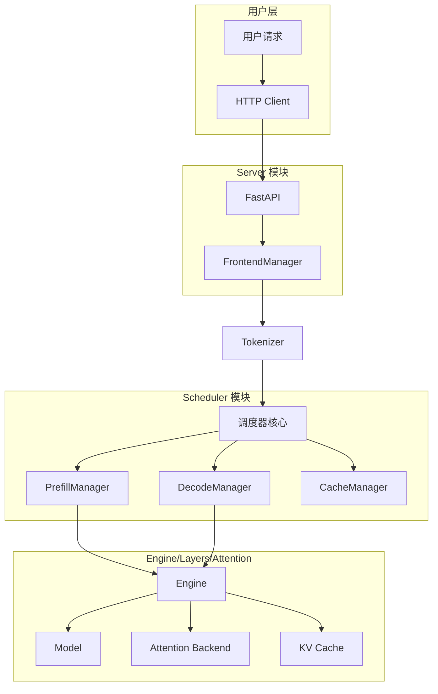

**第一层：用户请求入口层**

这是用户与系统交互的入口点。Mini-SGLang 提供了两个 HTTP 端点：
- `/generate`：通用文本生成接口
- `/v1/chat/completions`：OpenAI 兼容的聊天完成接口

**第二层：Server 服务层**

负责 HTTP 协议处理、全局状态管理、进程编排：
- **api_server.py**：FastAPI 应用，处理 HTTP 请求
- **launch.py**：进程启动器，负责 spawn 各个 worker 进程

**第三层：Scheduler 调度层**

这是 Mini-SGLang 的"大脑"，负责：
- 请求调度与批次管理
- 资源分配（KV Cache pages、token indices）
- 协调各个管理器（Prefill/Decode/Cache/Table）

**第四层：Engine/Layers/Attention 引擎层**

实际执行模型推理：
- **Engine**：推理引擎，协调各组件
- **Model**：模型前向传播
- **Attention**：注意力计算（可插拔后端）
- **KV Cache**：键值对存储

### 2.2 进程间通信架构

Mini-SGLang 采用多进程架构，每个进程专注于特定任务

**进程角色分配**

| 进程 | 数量 | 职责 |
|------|------|------|
| API Server | 1 | HTTP 请求处理，结果返回 |
| Tokenizer | num_tokenizer（可为0） | 文本 Tokenization（当 `num_tokenizer=0` 时，由 Detokenizer 进程处理） |
| Detokenizer | 1 | 文本 Detokenization（当 `num_tokenizer=0` 时，同时处理 Tokenization） |
| Scheduler | world_size | 请求调度、模型推理（每个 rank 一个） |

**ZMQ 通信模式**

| 通信对 | 方向 | 用途 |
|--------|------|------|
| API ↔ Tokenizer | 双向 | 发送 TokenizeMsg（地址4），接收 UserReply（地址3） |
| Tokenizer ↔ Scheduler | 单向 | 发送 UserMsg（地址0） |
| Scheduler ↔ Detokenizer | 单向 | 发送 DetokenizeMsg（地址1） |
| Detokenizer ↔ API | 单向 | 发送 UserReply（地址3） |

**注**：当 `num_tokenizer = 0` 时，Tokenizer 与 Detokenizer 为同一进程，地址1和地址4相同。

**地址格式说明**：
实际 ZMQ 地址包含进程 ID 后缀避免冲突，格式为：`ipc:///tmp/minisgl_{编号}.pid={进程ID}`
编号范围 0-4，对应不同通信链路：0 (Tokenizer→Scheduler), 1 (Scheduler→Detokenizer), 2 (Rank 0 广播), 3 (Detokenizer→API), 4 (API→Tokenizer，当 `num_tokenizer>0` 时使用)。

### 2.3 完整数据流

让我们追踪一个请求从用户到响应的完整旅程：

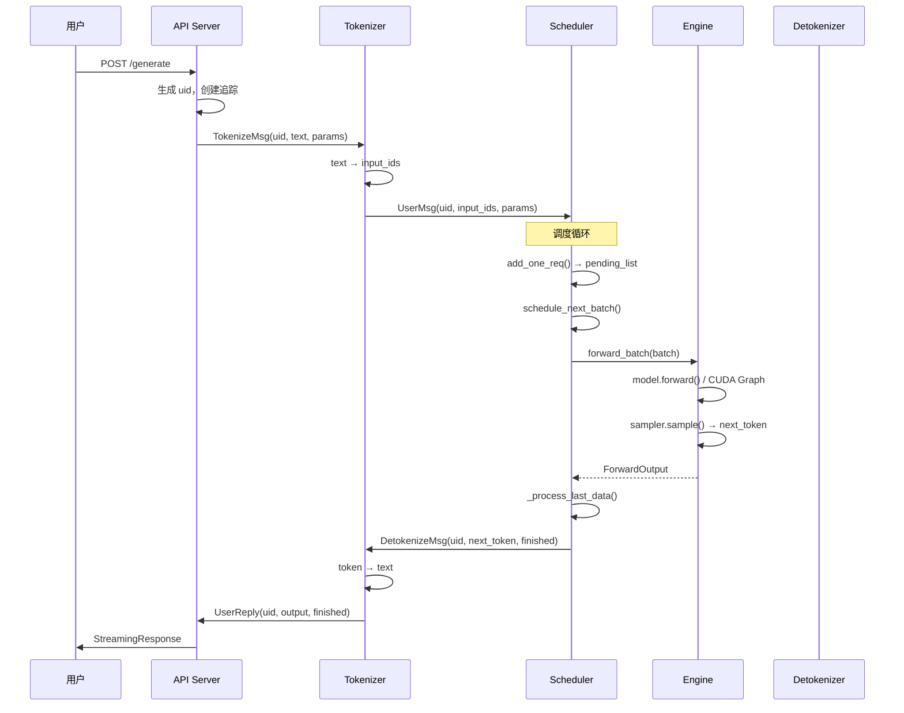

**数据流详解**

1. **请求入口**：用户发送 HTTP 请求，API Server 创建唯一标识 uid
2. **Tokenization**：Tokenizer 进程将文本转换为 token IDs
3. **调度决策**：Scheduler 决定如何批次请求、何时运行
4. **模型推理**：Engine 执行模型前向传播
5. **采样生成**：Sampler 根据参数生成下一个 token
6. **Detokenization**：将 token 转换回文本
7. **结果返回**：通过流式响应返回给用户

### 2.4 架构设计的考量

**进程隔离**

将 Tokenizer/Detokenization 与 Scheduler 分离：
- Tokenization 是 CPU-bound 任务，会阻塞整个流水线
- 分离后可以实现真正的并行处理
- 某个组件崩溃不会影响其他组件

**ZMQ 的选择**

选择 ZMQ 而不是其他消息队列：
- 高性能：专为高性能场景设计
- 简单易用：无需维护消息队列服务
- 跨平台：支持多种操作系统

**Rank 0 的特殊角色**

在分布式场景中，Rank 0 负责：
- 接收所有来自 Tokenizer 的 UserMsg
- 广播消息到其他 rank
- 聚合各 rank 的结果

---

## 三、调度器核心：Scheduler 模块深度解析

如果说 Engine 是 Mini-SGLang 的心脏，那么 Scheduler 就是它的大脑。在这个章节，我们将深入探索这个核心模块的设计与实现。

### 3.1 为什么需要调度器？

在深入代码之前，让我们先思考一个根本问题：为什么推理系统需要一个专门的**调度器**？

**批处理与延迟的矛盾**

假设你经营一家快递站。每收到一个包裹，你有两种选择：
1. **立即发货**：虽然快，但货车可能只装了一半就出发，浪费运力
2. **攒够一车再发**：虽然运力利用率高，但每个包裹都要等很久

这就是推理系统面临的经典困境：**批处理吞吐量 vs 单请求延迟**。

**Prefill 与 Decode 的冲突**

LLM 的推理分为两个阶段：
- **Prefill（预填充）**：处理输入序列，计算所有 token 的 KV
- **Decode（解码）**：自回归地生成下一个 token

这两个阶段有不同的计算特性：
- Prefill 是计算密集型（compute-bound），适合大批量
- Decode 是内存密集型（memory-bound），适合小批量

简单的 FIFO 调度会导致：
- 长 Prefill 请求阻塞短 Decode 请求
- GPU 利用率波动剧烈

### 3.2 Scheduler 的整体架构

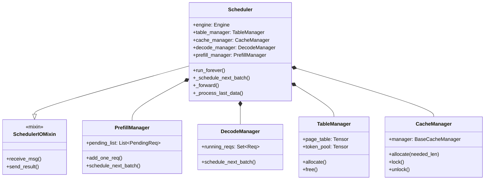

**核心组件职责**

| 组件 | 职责 |
|------|------|
| Scheduler | 主协调者，管理整个调度流程 |
| PrefillManager | 管理待处理的请求（`pending_list`） |
| DecodeManager | 管理正在运行的请求（`running_reqs`） |
| TableManager | 管理 token/page 表的分配 |
| CacheManager | 管理 KV Cache 的分配和释放，包括前缀匹配（`match_req`）、缓存清理和完整性检查 |

### 3.3 PrefillManager：分块预填充策略

PrefillManager 是调度策略的关键，它决定哪些请求应该被打包成批次：

```python
@dataclass
class PrefillManager:
    cache_manager: CacheManager
    table_manager: TableManager
    decode_manager: DecodeManager
    pending_list: List[PendingReq] = field(default_factory=list)
    
    def schedule_next_batch(self, prefill_budget: int) -> Batch | None:
        """根据预算调度下一批次"""
        # 关键实现：PrefillAdder 负责计算token预算和资源预留
        ...
```

**[Chunked Prefill](https://arxiv.org/abs/2403.02310) 原理**

```
请求 1: [======|====================]  (chunked into 2 parts)
请求 2: [=======|==] (chunked into 2 parts)
请求 3: [=======]

预算: 8192 tokens

Iteration 1 (Prefill-only view):
┌──────────────────────────────────────────┐
│ 请求1 (part) │ 请求2 (part) │ 请求3 (full) │
└──────────────────────────────────────────┘
     ↑           ↑
   chunk size is determined by remaining token budget

Iteration 2:
┌──────────────────────────────────────────┐
│ 请求1 (剩余) │ 请求2 (剩余)                │
└──────────────────────────────────────────┘
```

> **实现细节**：分块预填充通过 `ChunkedReq` 类表示分块请求，通过 `PrefillAdder` 类管理资源分配和预算计算。

**为什么需要分块？**

假设有一个 10000 token 的请求和 10 个 100 token 的请求：
- 如果不分割：所有请求等待 10000 token 完成（首 token 延迟 ≈ 10000）
- 如果分块：第一个批次处理 8192 tokens（首 token 延迟 ≈ 8192）
- 实际效果：短请求的首 token 延迟大幅降低

### 3.4 DecodeManager：运行中请求管理

DecodeManager 跟踪所有正在运行的请求：

```python
@dataclass
class DecodeManager:
    running_reqs: Set[Req] = field(default_factory=set)
    
    @property
    def inflight_tokens(self) -> int:
        """预估 decode 阶段的 token 数量"""
        return sum(req.remain_len for req in self.running_reqs)
```

**整体调度决策逻辑**

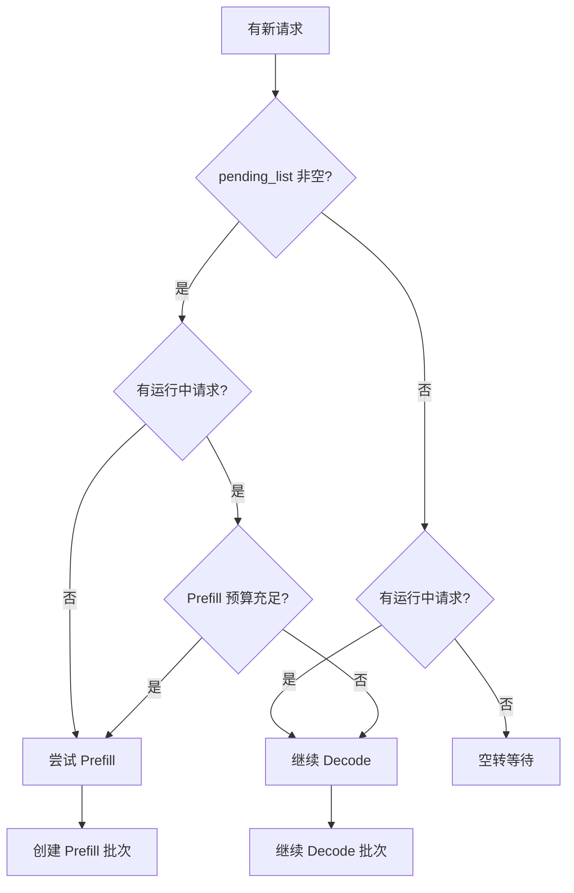

### 3.5 [Overlap Scheduling](https://www.usenix.org/conference/osdi22/presentation/yu)：重叠调度，消除空闲期

这是 Mini-SGLang 最核心的性能优化之一。传统的调度模式是：

```
CPU: [接收请求][调度][准备批次] ──────────[接收请求][调度][准备批次]
GPU:                        [前向传播][采样]                    [前向传播][采样]
```

CPU 有大段空闲时间，GPU 也经常等待 CPU。

**Overlap 模式下的时序图：**

```
CPU:  [R]接收 [P]调度 [B]准备批次     [R]接收 [P]调度 [B]准备批次
      │      │      │                  │      │      │
GPU:  ════════════════════════════════════[前向][采样]═══════════════
      │              │                        │       │
      │              └────────等待完成────────┘       │
      │                      (GPU 完成通知 CPU)       │
      └──────────────────────────────────────────────┘
```

**实现原理：**

```python
def overlap_loop(self, last_data: ForwardData | None) -> ForwardData | None:
    # Step 1: CPU 处理消息（动态阻塞）
    blocking = not (
        last_data  # 如果有待处理的批次，则不阻塞
        or self.prefill_manager.runnable
        or self.decode_manager.runnable
    )
    for msg in self.receive_msg(blocking=blocking):
        self._process_one_msg(msg)

    # Step 2: 准备下一批次
    forward_input = self._schedule_next_batch()
    ongoing_data = None
    if forward_input is not None:
        # Step 3: GPU 执行推理（使用引擎的 CUDA 流）
        with self.engine_stream_ctx:  # 切换到引擎流
            self.engine.stream.wait_stream(self.stream)  # 等待调度流完成
            ongoing_data = (forward_input, self._forward(forward_input))

    # Step 4: 处理上次结果并返回
    self._process_last_data(last_data, ongoing_data)
    return ongoing_data
```

**效果分析：**

| 指标 | 传统模式 | Overlap 模式 |
|------|----------|--------------|
| CPU 利用率 | 低 | 高 |
| GPU 利用率 | 中 | 高 |
| 首 token 延迟 | 高 | 低 |
| 整体吞吐 | 中 | 高 |

### 3.6 TableManager：资源分配专家

TableManager 负责管理两个关键资源：

```python
class TableManager:
    def __init__(self, max_running_reqs: int, page_table: torch.Tensor):
        self._free_slots = list(range(max_running_reqs))
        self.page_table = page_table
        self.token_pool = torch.zeros_like(page_table, dtype=torch.int32)
    
    def allocate(self) -> int:
        """分配一个 page，返回索引"""
        return self._free_slots.pop()
    
    def free(self, slot: int) -> None:
        """释放一个 page"""
        self._free_slots.append(slot)
```

**Page Table 的作用：**

```
物理 Block 池（GPU显存中的KV Cache块）:
┌─────────┬─────────┬─────────┬─────────┬─────────┬─────────┐
│Block 0  │Block 1  │Block 2  │Block 3  │Block 4  │Block 5  │
│ (used)  │ (used)  │ (used)  │ (free)  │ (used)  │ (free)  │
└─────────┴─────────┴─────────┴─────────┴─────────┴─────────┘

每个请求有自己的 Block Table（逻辑块→物理块映射）:

Request A 的 Block Table:          Request B 的 Block Table:
┌───────────┬───────────┐          ┌───────────┬───────────┬───────────┐
│ Logical 0 │ Logical 1 │          │ Logical 0 │ Logical 1 │ Logical 2 │
│     ↓     │     ↓     │          │     ↓     │     ↓     │     ↓     │
│ Physical 0│ Physical 2│          │ Physical 1│ Physical 4│ Physical 6│
└───────────┴───────────┘          └───────────┴───────────┴───────────┘

Attention计算时:
- 根据请求的 block_table 找到物理块位置
- 从对应物理块读取 K, V cache

当调度批次时：
- 为每个请求分配 page
- 记录 page 与请求的映射关系
- 批次结束后释放 page
```

---

## 四、推理引擎：Engine 模块核心解读

如果说 Scheduler 是调度中心，那么 Engine 就是执行引擎。

### 4.1 Engine 的职责边界

Engine 在 Mini-SGLang 中扮演什么角色？它与 Scheduler 的关系是什么？

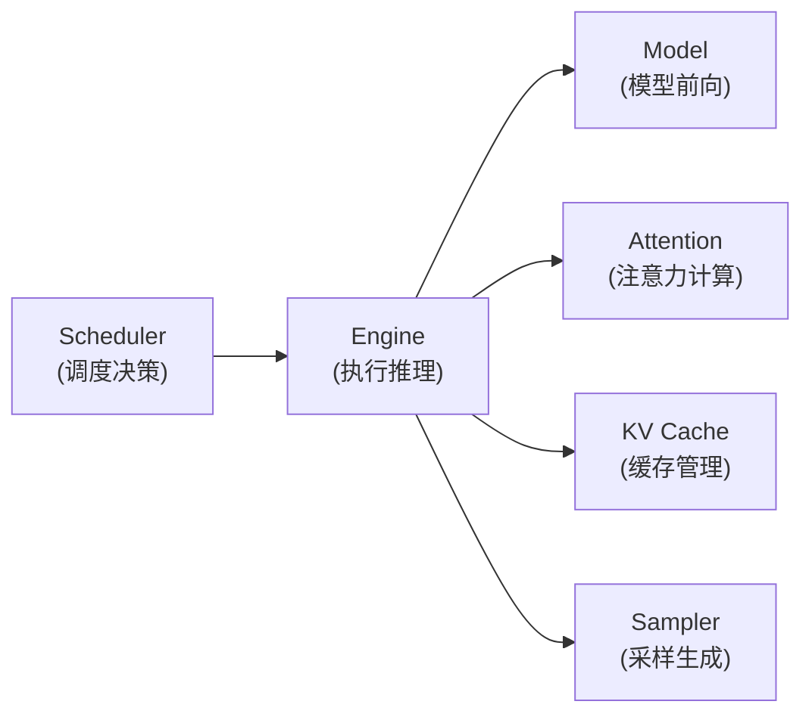

**Engine 的核心职责：**

1. **资源初始化**：加载模型、创建 KV Cache、初始化 attention 后端
2. **前向传播**：执行模型推理
3. **采样生成**：根据 logits 生成下一个 token

**Engine 与 Scheduler 的分工：**

| 方面 | Scheduler | Engine |
|------|-----------|--------|
| 决策 | 决定何时运行、运行哪些请求 | 只负责执行 |
| 资源 | 分配 token/page indices | 使用给定资源 |
| 状态 | 管理请求生命周期 | 无状态计算 |

### 4.2 Engine 的核心组件

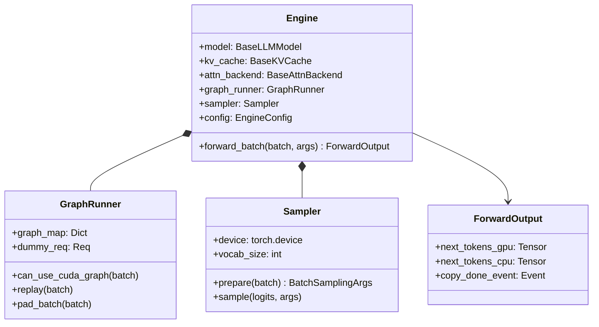

### 4.3 CUDA Graph：消除 Python 开销

CUDA Graph 是 NVIDIA 推出的一项技术，用于将一段固定计算路径的 CUDA kernel 调用序列捕获为静态执行图，从而显著减少 Python 与 CUDA 驱动层的调度与 launch 开销。

**传统执行模式的问题：**

```
Python:        for i in range(100):
                   output = model(input)
                    │ 每次 iteration 都需要发起多次 kernel launch
                    ▼
CUDA Driver:   launch kernel 1 → launch kernel 2 → launch kernel 3
                    │
                    ▼
GPU:           compute → compute → compute
```

- 1. 每个 iteration 都涉及多次 Python → CUDA driver 调用
- 2. kernel launch 开销在 小 kernel / 高频推理 场景中不可忽略

**CUDA Graph 模式：**

```
捕获阶段:        with torch.cuda.graph(graph):
                    output = model(input)
                    │ 捕获一次固定的 kernel 执行序列（static shape）
                    ▼
执行阶段:        graph.replay()
                    │ 单次 CUDA Graph launch
                    ▼
GPU:           [kernel 1][kernel 2][kernel 3] ...（按原顺序执行）
```

- 1、kernel launch 次数从 O(N kernels) → O(1 graph)

- 2、显著降低 Python 与 CUDA driver 调度开销

- 3、在 decode / 小 batch / 高频推理场景下效果尤为明显

**Mini-SGLang 中的实现：**

> **注意**：实际实现包含更多辅助方法，如 `pad_batch()`（填充批次至图形大小）、`destroy_cuda_graphs()`（销毁图形资源）和 `_determine_cuda_graph_bs()`（自动确定图形批次大小）等。

```python
class GraphRunner:
    # 实际构造函数参数更多，包括 stream, device, model, attn_backend 等
    def __init__(self, max_graph_bs: int, ...):
        self.graph_map: Dict[int, torch.cuda.CUDAGraph] = {}
        self.graph_bs_list: List[int] = []
        self.max_graph_bs = max_graph_bs
        self.dummy_req = self._create_dummy_req()
        self.logits = torch.empty((max_graph_bs, vocab_size), dtype=torch.float32)
    
    def _capture_graphs(self, max_seq_len: int, vocab_size: int, model: BaseLLMModel):
        """捕获不同 batch_size 的计算图"""
        for bs in self.graph_bs_list:
            # 使用 dummy_req 构造批次
            batch = Batch(reqs=[self.dummy_req] * bs, phase="decode")
            self.attn_backend.prepare_for_capture(batch)
            
            with get_global_ctx().forward_batch(batch):
                with torch.cuda.graph(self.graph):
                    self.logits[:bs] = model.forward()
            
            self.graph_map[bs] = self.graph
    
    def can_use_cuda_graph(self, batch: Batch) -> bool:
        """判断是否可以使用 CUDA Graph"""
        return batch.is_decode and batch.size <= self.max_graph_bs
    
    def replay(self, batch: Batch) -> torch.Tensor:
        """重放计算图"""
        assert self.can_use_cuda_graph(batch)
        g = self.graph_map[batch.padded_size]
        self.attn_backend.prepare_for_replay(batch)
        g.replay()
        return self.logits[:batch.size]
```

**为什么 Decode 阶段特别适合 CUDA Graph？**

Decode 阶段的特性：
- Batch size 相对固定
- 计算模式单一
- 重复执行相同操作

这正好符合 CUDA Graph 的优势场景。

### 4.4 Sampler：采样策略的实现

Sampler 负责将模型输出的 logits 转换为实际的 token ID。Mini-SGLang 使用 flashinfer.sampling 库进行高效的采样：

```python
@dataclass
class Sampler:
    device: torch.device
    vocab_size: int
    
    def prepare(self, batch: Batch) -> BatchSamplingArgs:
        """将 SamplingParams 转换为张量"""
        params = [r.sampling_params for r in batch.reqs]
        
        # 处理贪婪解码特殊情况
        if all(p.is_greedy for p in params):
            return BatchSamplingArgs(temperatures=None)
        
        # 边界值处理
        MIN_P = MIN_T = 1e-6
        ts = [max(0.0 if p.is_greedy else p.temperature, MIN_T) for p in params]
        top_ks = [p.top_k if p.top_k >= 1 else self.vocab_size for p in params]
        top_ps = [min(max(p.top_p, MIN_P), 1.0) for p in params]
        
        # 创建 GPU 张量
        temperatures = make_device_tensor(ts, torch.float32, self.device)
        top_k, top_p = None, None
        if any(k != self.vocab_size for k in top_ks):
            top_k = make_device_tensor(top_ks, torch.int32, self.device)
        if any(p < 1.0 for p in top_ps):
            top_p = make_device_tensor(top_ps, torch.float32, self.device)
        
        return BatchSamplingArgs(temperatures, top_k=top_k, top_p=top_p)
    
    def sample(self, logits: torch.Tensor, args: BatchSamplingArgs) -> torch.Tensor:
        """采样下一个 token"""
        # 贪婪解码
        if args.temperatures is None:
            return torch.argmax(logits, dim=-1)
        
        # 使用 flashinfer 库进行高效采样
        import flashinfer.sampling as sampling
        probs = sampling.softmax(logits.float(), args.temperatures)
        
        if args.top_k is None and args.top_p is None:
            return sampling.sampling_from_probs(probs)
        
        # Top-k 和 Top-p 混合采样
        if args.top_p is None:
            return sampling.top_k_sampling_from_probs(probs, args.top_k)
        
        if args.top_k is None:
            return sampling.top_p_sampling_from_probs(probs, args.top_p)
        
        return sampling.top_k_top_p_sampling_from_probs(probs, args.top_k, args.top_p)
```

### 4.5 ForwardOutput：推理结果的封装

Engine.forward_batch() 返回的不是简单的 logits，而是一个结构化的结果：

```python
class ForwardOutput(NamedTuple):
    next_tokens_gpu: torch.Tensor  # GPU 上的 next token IDs
    next_tokens_cpu: torch.Tensor  # 同步到 CPU 的版本
    copy_done_event: torch.cuda.Event  # 异步拷贝完成事件
```

**为什么需要这个设计？**

1. **GPU → CPU 异步拷贝**：`next_tokens_gpu` 在 GPU 上，`next_tokens_cpu` 在 CPU 上。异步拷贝避免阻塞 CPU。
2. **事件同步**：`copy_done_event` 用于等待异步拷贝完成。

**实现原理：**

```python
def forward_batch(self, batch: Batch, args: BatchSamplingArgs) -> ForwardOutput:
    assert torch.cuda.current_stream() == self.stream

    with self.ctx.forward_batch(batch):
        # 关键优化：判断是否可以使用 CUDA Graph
        if self.graph_runner.can_use_cuda_graph(batch):
            # Decode 阶段使用预捕获的 CUDA Graph 重放，消除 Python 开销
            logits = self.graph_runner.replay(batch)
        else:
            # Prefill 阶段或超出 Graph 范围时，正常执行模型推理
            logits = self.model.forward()

    # 更新每个请求的状态
    for req in batch.reqs:
        req.complete_one()

    # 采样得到下一个 token（注意切片和类型转换）
    next_tokens_gpu = self.sampler.sample(logits[: batch.size], args).to(torch.int32)

    # 异步拷贝到 CPU
    next_tokens_cpu = next_tokens_gpu.to("cpu", non_blocking=True)

    # 创建同步事件并记录到当前流
    copy_done_event = torch.cuda.Event()
    copy_done_event.record(self.stream)

    return ForwardOutput(next_tokens_gpu, next_tokens_cpu, copy_done_event)
```

**关键设计要点：**

1. **CUDA Graph 条件判断**：`can_use_cuda_graph(batch)` 检查是否为 Decode 阶段且 batch size 在预捕获范围内
2. **Graph 重放 vs 正常推理**：Decode 阶段使用 `replay()` 消除 Python 开销，Prefill 阶段正常执行 `model.forward()`
3. **状态更新**：每次推理后调用 `req.complete_one()` 更新请求的 `cached_len` 和 `device_len`
4. **类型转换**：采样结果转换为 `int32` 类型以节省内存

---

## 五、注意力后端：Attention 模块的可插拔设计

注意力机制是 Transformer 的核心。Mini-SGLang 采用了可插拔的后端设计，让用户可以根据硬件选择最优实现。

### 5.1 BaseAttnBackend 抽象基类

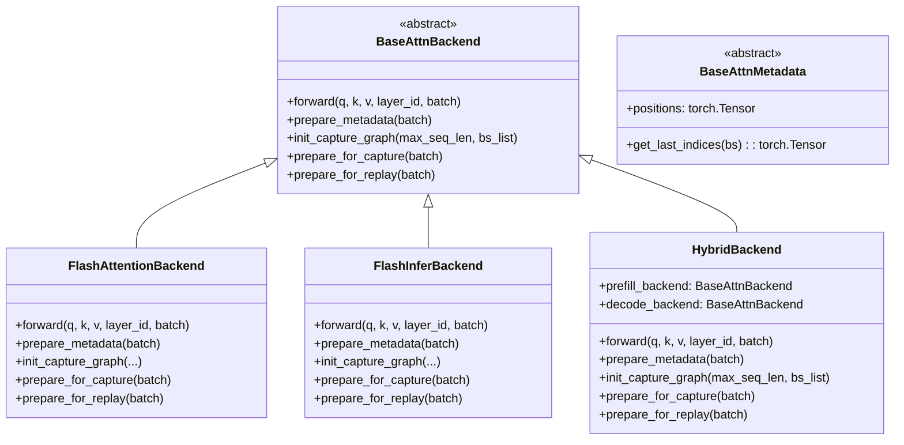

**BaseAttnMetadata 抽象基类**：注意力后端通过 `prepare_metadata` 方法为每个批次计算注意力元数据（如位置信息），存储在 `Batch.attn_metadata` 字段中。具体后端会实现自己的元数据类，例如 `FlashInferBackend` 使用 `FIMetadata` 来存储 PagedAttention 所需的块表等信息。

### 5.2 [FlashAttention](https://arxiv.org/abs/2205.14135)：分块计算的典范

FlashAttention 是一种**减少** HBM（高带宽内存）访问的注意力计算算法：

```
传统实现：
┌─────────────────────────────────────────────────────────────┐
│ 从 HBM 读取 Q, K, V                                          │
│ 计算 Q×Kᵀ → S，写回 HBM (O(N²) 读写)                         │
│ softmax(S) → P，写回 HBM (O(N²) 读写)                        │
│ P×V → O (O(N²) 读写)                                         │
│ 总计: O(N²) HBM 读写（主要瓶颈是 N×N 中间矩阵）                │
└─────────────────────────────────────────────────────────────┘

FlashAttention：
┌─────────────────────────────────────────────────────────────┐
│ 将 Q, K, V 分块                                              │
│ 对每个 Q 块，遍历所有 K, V 块在 SRAM 中计算                    │
│ 使用在线 softmax 累加，无需存储 N×N 中间矩阵                   │
│ 总计: O(N²d²/M)，当 M=Θ(Nd) 时约为 O(Nd)                     │
└─────────────────────────────────────────────────────────────┘
```

**SRAM vs HBM：**

| 特性 | SRAM (on-chip) | HBM (off-chip) |
|------|----------------|----------------|
| 带宽 | ~10 TB/s | ~1 TB/s |
| 容量 | 数十 MB | 数十 GB |
| 延迟 | 纳秒级 | 微秒级 |

FlashAttention 通过分块计算，将大部分数据保留在高速 SRAM 中，大大减少了与慢速 HBM 的数据交换。

### 5.3 [FlashInfer](https://arxiv.org/abs/2501.01005)：Decode 优化的利器

FlashInfer 提供了对 **PagedAttention** 的高效 kernel 实现

#### 传统 KV Cache 存储：
```
GPU 显存布局：
┌───────────────────────────────────────────────────┐
│ Seq 1: [Token0 KV][Token1 KV][Token2 KV]...       │ 预分配连续空间
├───────────────────────────────────────────────────┤
│        ← 内存碎片（无法利用）→                      │
├───────────────────────────────────────────────────┤
│ Seq 2: [Token0 KV][Token1 KV][Token2 KV]...       │ 预分配连续空间
└───────────────────────────────────────────────────┘
```
问题：
- 需要按最大长度预分配，造成大量浪费（内部碎片）
- 序列长度不同导致内存碎片（外部碎片）
- 无法在序列间共享 KV Cache

#### PagedAttention 存储：
```
KV Cache (分页存储):

物理 Block Pool（GPU显存中）:
┌──────────────────┬──────────────────┬──────────────────┐
│ Physical Block 0 │ Physical Block 1 │ Physical Block 2 │ ...
│ [K0-K15, V0-V15] │ [K0-K15, V0-V15] │ [K0-K15, V0-V15] │
└──────────────────┴──────────────────┴──────────────────┘
         ↑                   ↑                   ↑
         │                   │                   │
    ┌────┴────┐         ┌────┴────┐         ┌────┴────┐
    │         │         │         │         │         │
┌───────────────────┐  ┌───────────────────┐
│ Seq1 PageTable    │  │ Seq2 PageTable    │
│ [0, 2, 5, ...]    │  │ [1, 3, 0, ...]    │  ← 每个序列有自己的PageTable
└───────────────────┘  └───────────────────┘
```

**优势：**
- 内存碎片化减少：物理块不需要连续，按需分配，序列生成新 token 时，只需分配新的物理块并更新 page table
- 更容易实现 KV Cache 的共享和复用：多个序列可以共享相同的物理块
- 支持更长的上下文
- 内存利用率高：避免了传统实现中预分配最大长度导致的浪费

### 5.4 HybridBackend：混合策略

为什么需要 HybridBackend？因为 Prefill 和 Decode 有不同的最优算法：

```python
class HybridBackend(BaseAttnBackend):
    def __init__(
        self,
        prefill_backend: BaseAttnBackend,   # 例如: FlashAttention
        decode_backend: BaseAttnBackend,     # 例如: FlashInfer
    ) -> None:
        self.prefill_backend = prefill_backend
        self.decode_backend = decode_backend
    
    def forward(self, q, k, v, layer_id, batch):
        # 根据 batch 类型选择后端
        if batch.is_prefill:
            backend = self.prefill_backend
        else:
            backend = self.decode_backend
        return backend.forward(q, k, v, layer_id, batch)
    
    def prepare_metadata(self, batch):
        if batch.is_prefill:
            backend = self.prefill_backend
        else:
            backend = self.decode_backend
        return backend.prepare_metadata(batch)
    
    def init_capture_graph(self, max_seq_len: int, bs_list: List[int]) -> None:
        # 仅 decode 后端需要 CUDA Graph 捕获
        self.decode_backend.init_capture_graph(max_seq_len, bs_list)
    
    def prepare_for_capture(self, batch: Batch) -> None:
        self.decode_backend.prepare_for_capture(batch)
    
    def prepare_for_replay(self, batch: Batch) -> None:
        self.decode_backend.prepare_for_replay(batch)
```

**混合策略的优势：**

| 场景 | Prefill 后端 | Decode 后端 | 原因 |
|------|-------------|-------------|------|
| 长序列 + 高吞吐 | FlashAttention | FlashInfer | FlashAttention擅长长序列 |
| 短序列 + 高并发 | FlashAttention | FlashInfer | FlashInfer的decode优化 |
| 极致性能 | FlashAttention | FlashInfer | 各取所长 |

---

## 六、KV Cache 管理：记忆的存储与复用

KV Cache 是 LLM 推理中最昂贵的资源之一。Mini-SGLang 提供了两种 Cache 管理策略：RadixCache（激进优化）和 NaiveCache（简单场景）。所有缓存管理器都继承自 `BaseCacheManager` 抽象基类，该基类定义了 `match_prefix`、`lock_handle`、`insert_prefix`、`evict`、`reset`、`size_info` 和 `check_integrity` 等核心方法。

### 6.1 为什么需要 KV Cache？

在自回归解码中，每个 token 的生成都需要 attention 所有之前的 token：

```
Token 1: "The"     → 计算 K1, V1
Token 2: "cat"     → 计算 K2, V2 + attention([K1, K2], [V1, V2])
Token 3: "sat"     → 计算 K3, V3 + attention([K1, K2, K3], [V1, V2, V3])
...
```

如果每次都重新计算所有 KV，会造成巨大的计算浪费。KV Cache 的思想是：**保存历史 KV，下次直接复用**。

**KV Cache 的内存占用估算：**

假设模型参数量 70 亿，FP16 存储：

| 参数 | 数值 |
|------|------|
| 层数 | 32 |
| 隐藏层维度 | 4096 |
| 头数 | 32 |
| 每头维度 | 128 |
| 序列长度 | 4096 |

KV Cache 大小 ≈ 2 × 32 × 32 × 128 × 4096 × 2 bytes ≈ **2 GB**

这还只是一个请求！如果并发处理 100 个请求，KV Cache 占用可达 200 GB。

### 6.2 MHAKVCache：存储布局

Mini-SGLang 的 KV Cache 采用高效的存储布局：

```python
class MHAKVCache(BaseKVCache):
    def __init__(
        self,
        num_kv_heads: int,           # KV 头总数（模型定义）
        num_layers: int,             # 层数
        head_dim: int,               # 每头维度
        num_pages: int,              # 页面数
        dtype: torch.dtype,          # 数据类型（如 torch.float16）
        kv_layout: KVCacheLayout,    # 存储布局
        device: torch.device,        # 设备（GPU）
    ):
        from minisgl.distributed import get_tp_info
        from minisgl.utils import divide_even
        
        tp_info = get_tp_info()
        # 在张量并行环境下，每个 GPU 只负责一部分 KV 头
        local_kv_heads = divide_even(num_kv_heads, tp_info.size)
        
        match kv_layout:
            case KVCacheLayout.PageFirst:
                kv_buffer = torch.empty(
                    (2, num_pages, num_layers, local_kv_heads, head_dim),
                    device=device,
                    dtype=dtype,
                ).permute(0, 2, 1, 3, 4)
            case KVCacheLayout.LayerFirst:
                kv_buffer = torch.empty(
                    (2, num_layers, num_pages, local_kv_heads, head_dim),
                    device=device,
                    dtype=dtype,
                )
        
        self._kv_buffer = kv_buffer.view(2, num_layers, num_pages, 1, local_kv_heads, head_dim)
        self._num_layers = num_layers
        self._k_buffer = self._kv_buffer[0]  # [layer][page][1][local_kv_heads][head_dim]
        self._v_buffer = self._kv_buffer[1]  # [layer][page][1][local_kv_heads][head_dim]
        self._device = device
        self._storage_shape = (num_pages, local_kv_heads, head_dim)
```

**分布式处理**：在张量并行（Tensor Parallelism）环境下，KV 头会被均匀分配到多个 GPU 上。每个 GPU 只负责存储和处理 `local_kv_heads = num_kv_heads / tp_size` 个 KV 头。`get_tp_info()` 获取当前进程的张量并行信息，`divide_even` 确保均匀分配。

**存储布局对比：**

```
**两种布局的核心区别**：

虽然两种布局最终的**逻辑形状**相同（都是 `[2, num_layers, num_pages, heads, dim]`），但它们的**物理内存排列**完全不同：

LayerFirst 物理内存布局:
┌──────────────────────────────────────────────────┐
│ Layer 0                                          │
│ ┌─────────┬─────────┬─────────┬─────────┐       │
│ │ Page 0  │ Page 1  │ Page 2  │ Page 3  │ ...   │  ← 同一层的页面在内存中连续
│ └─────────┴─────────┴─────────┴─────────┘       │
├──────────────────────────────────────────────────┤
│ Layer 1                                          │
│ ┌─────────┬─────────┬─────────┬─────────┐       │
│ │ Page 0  │ Page 1  │ Page 2  │ Page 3  │ ...   │
│ └─────────┴─────────┴─────────┴─────────┘       │
└──────────────────────────────────────────────────┘

PageFirst 物理内存布局（permute 前）:
┌──────────────────────────────────────────────────┐
│ Page 0                                           │
│ ┌─────────┬─────────┬─────────┬─────────┐       │
│ │ Layer 0 │ Layer 1 │ Layer 2 │ Layer 3 │ ...   │  ← 同一页面的所有层在内存中连续
│ └─────────┴─────────┴─────────┴─────────┘       │
├──────────────────────────────────────────────────┤
│ Page 1                                           │
│ ┌─────────┬─────────┬─────────┬─────────┐       │
│ │ Layer 0 │ Layer 1 │ Layer 2 │ Layer 3 │ ...   │
│ └─────────┴─────────┴─────────┴─────────┘       │
└──────────────────────────────────────────────────┘

PageFirst 实际优势:
- 经过 permute 后最终布局与 LayerFirst 相同
- 但创建时逻辑更清晰（按页面分配）
```

### 6.3 RadixCacheManager：前缀复用的黑科技

RadixCacheManager 是 Mini-SGLang 最独特的优化之一。它使用基数树（Radix Tree）组织 KV Cache，实现前缀复用。

**Radix Tree 数据结构：**

```
请求 1: "Hello, how are you?"
请求 2: "Hello, how is the weather?"
请求 3: "Goodbye, see you later!"

Radix Tree 结构:

Token-Level Radix Tree:

              (root)
             /      \
      [Hello,]    [Goodbye, see you later!]
          │                  │
       [how ]            [无共享前缀]
        /   \
   [are ]  [is the ]
      │        │
   [you?]  [weather?]
      │        │
   Cache    Cache
  Created   Reused ← "Hello, how " 部分复用
```
上面演示的是`token-level`的缓存复用，现实更多是`message-level`或者说`token-block`级别的缓存复用：

**message-level**


**token block level** (DEEPSEEK官网：64个token为一个存储单元)


**前缀匹配流程（实际实现）：**

```python
# 注意：以下代码为简化示例，实际实现细节（如时间戳更新策略、变量命名）可能有所不同
class RadixCacheManager(BaseCacheManager):
    def _walk(self, input_ids: torch.Tensor) -> Tuple[RadixTreeNode, int]:
        """实际的前缀匹配算法，支持部分匹配和节点分割"""
        prefix_len = 0
        node = self.root_node
        
        while prefix_len < len(input_ids):
            this_id = int(input_ids[prefix_len].item())
            if this_id not in node.children:
                return node, prefix_len
            
            node = node.children[this_id]
            match_len = node.get_match_len(input_ids[prefix_len:])  # 关键：部分匹配检测
            prefix_len += match_len
            
            if match_len != node.length:  # 需要分割节点
                node = node._split_at(match_len)
                return node, prefix_len
            
            node.timestamp = time.monotonic_ns()  # 更新时间戳
        
        return node, prefix_len
    
    def match_prefix(self, input_ids: torch.Tensor) -> Tuple[BaseCacheHandle, torch.Tensor]:
        """查找匹配的前缀，返回 handle 和已匹配的 indices"""
        node, prefix_len = self._walk(input_ids)
        if prefix_len == 0:
            return RadixCacheHandle(prefix_len, node), self.empty_tensor
        
        # 构建匹配的 indices 列表
        value_list: List[torch.Tensor] = []
        matched_node = node
        while not node.is_root():
            value_list.append(node.value)
            node = node.parent
        value_list.reverse()
        
        return RadixCacheHandle(prefix_len, matched_node), torch.cat(value_list)
```

### 6.4 LRU 驱逐策略

当 KV Cache 满了之后，需要驱逐旧内容。RadixCacheManager 使用 LRU（最近最少使用）策略：

```python
def evict(self, size: int) -> torch.Tensor:
    """使用 heapq 实现 LRU 驱逐"""
    if size == 0:
        return self.empty_tensor
    
    # 收集可驱逐的叶子节点
    leave_nodes = self._collect_leave_nodes_for_evict()
    heapq.heapify(leave_nodes)  # 按时间戳建最小堆
    
    evicted_indices: List[torch.Tensor] = []
    evicted_size = 0
    
    while evicted_size < size:
        node = heapq.heappop(leave_nodes)  # 弹出最老的节点
        evicted_size += node.length
        evicted_indices.append(node.value)
        self.evictable_size -= node.length
        
        # 从父节点删除子节点
        parent = node.parent
        del parent.children[int(node._key[0].item())]
        
        # 如果父节点变成叶子节点，也加入堆中
        if parent.is_leaf() and parent.ref_count == 0:
            heapq.heappush(leave_nodes, parent)
    
    return torch.cat(evicted_indices)
```

---

## 七、模型实现：Layers 与 Models 模块

在这个章节，我们将探索 Mini-SGLang 如何实现各种模型层，以及如何支持不同的模型架构。

### 7.1 模型层次结构

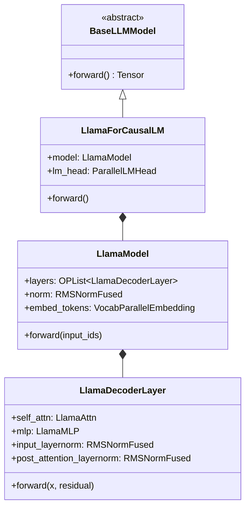

**图表符号说明**：
- `<|--` 表示**继承关系**：`LlamaForCausalLM` 继承自 `BaseLLMModel`
- `*--` 表示**组合关系**（非继承）：`LlamaForCausalLM` **包含** `LlamaModel`，`LlamaModel` **包含** `LlamaDecoderLayer`

> 注意：`LlamaModel` 和 `LlamaDecoderLayer` 都继承自 `BaseOP`（基础算子类），而不是继承自上层的模型类。这种组合设计使得各层可以独立复用。

**重要说明**：`LlamaAttn` 实际是 `RopeAttn` 的别名，`LlamaMLP` 是 `GatedMLP` 的别名，这是为了保持与 HuggingFace 命名的一致性。

**权重融合优化**：Mini-SGLang 在加载权重时执行融合优化，将 Q/K/V 三个投影矩阵合并为单个 `qkv_proj` 权重，将 gate/up 投影合并为 `gate_up_proj`，从而减少内存访问和 kernel 调用次数。

### 7.2 Attention Layer 的实现

Mini-SGLang 使用融合的 QKV 投影提高效率：

```python
class RopeAttn(BaseOP):
    def __init__(
        self,
        config: ModelConfig,
        layer_id: int,
        *,
        has_attn_bias: bool = False,
        has_qk_norm: bool = False,  # Qwen3 等模型需要设置为 True
    ):
        # 融合 QKV 投影（提高效率）
        self.qkv_proj = LinearQKVMerged(
            hidden_size=config.hidden_size,
            head_dim=config.head_dim,
            num_qo_heads=config.num_qo_heads,
            num_kv_heads=config.num_kv_heads,
            has_bias=has_attn_bias,
        )
        
        # 可选的 Q/K 归一化
        self.has_qk_norm = has_qk_norm
        if has_qk_norm:
            self.q_norm = RMSNorm(config.head_dim, eps=config.rms_norm_eps)
            self.k_norm = RMSNorm(config.head_dim, eps=config.rms_norm_eps)
        else:
            self.q_norm = None
            self.k_norm = None
        
        # 注意力层封装
        self.attn = AttentionLayer(
            layer_id=layer_id,
            head_dim=config.head_dim,
            num_qo_heads=config.num_qo_heads,
            num_kv_heads=config.num_kv_heads,
            rotary_config=config.rotary_config,
            q_norm=self.q_norm,
            k_norm=self.k_norm,
        )
        
        # 输出投影
        self.o_proj = LinearOProj(
            config.head_dim * config.num_qo_heads,
            config.hidden_size,
            has_bias=False,
        )
    
    @nvtx_annotate("MHA")
    def forward(self, x: torch.Tensor) -> torch.Tensor:
        """前向传播（使用全局上下文获取位置信息）"""
        qkv = self.qkv_proj.forward(x)
        del x  # 内存优化：立即释放输入张量
        o = self.attn.forward(qkv)  # 内部处理 RoPE 和注意力计算
        return self.o_proj.forward(o)
```

**关键设计：**
1. **融合 QKV 投影**：使用 `LinearQKVMerged` 一次性计算 Q、K、V，减少内存访问
2. **注意力层封装**：`AttentionLayer` 封装 RoPE 和注意力后端调用
3. **全局上下文**：通过 `get_global_ctx()` 获取位置信息，简化接口

### 7.3 RoPE 位置编码

RoPE（Rotary Position Embedding）是 LLM 中广泛使用的位置编码方案。Mini-SGLang 使用预计算缓存提高效率：

```python
class RotaryEmbedding(StateLessOP):
    def __init__(
        self,
        head_size: int,
        rotary_dim: int,
        max_position_embeddings: int,
        base: float,
        post_process: None | Callable[[torch.Tensor], torch.Tensor] = None,
    ) -> None:
        super().__init__()
        self.head_size = head_size
        assert rotary_dim == head_size  # Mini-SGLang 假设 rotary_dim 等于 head_size
        inv_freq = 1.0 / (base ** (torch.arange(0, rotary_dim, 2, dtype=torch.float) / rotary_dim))
        if post_process is not None:
            inv_freq = post_process(inv_freq)
        t = torch.arange(max_position_embeddings, dtype=torch.float)
        freqs = torch.einsum("i,j -> ij", t, inv_freq)
        cos = freqs.cos()
        sin = freqs.sin()
        # 缓存张量，不参与保存/加载
        self._cos_sin_cache = torch.cat((cos, sin), dim=-1)
        assert self.head_size in [64, 128, 256, 512]  # flashinfer 支持的 head_size

        from flashinfer import apply_rope_with_cos_sin_cache_inplace
        self.apply_rope_with_cos_sin_cache_inplace = apply_rope_with_cos_sin_cache_inplace
    
    def forward(
        self,
        positions: torch.Tensor,
        query: torch.Tensor,
        key: torch.Tensor,
    ) -> Tuple[torch.Tensor, torch.Tensor]:
        """应用 RoPE 位置编码（原地操作）"""
        self.apply_rope_with_cos_sin_cache_inplace(
            positions=positions,
            query=query,
            key=key,
            head_size=self.head_size,
            cos_sin_cache=self._cos_sin_cache,
        )
        return query, key
```

**实际使用**：在 Mini-SGLang 中，通常不直接实例化 `RotaryEmbedding`，而是通过 `get_rope` 工厂函数获取。该函数支持 `rope_scaling` 配置（如 Llama 3 的 LongRoPE），内部会创建适当的 `post_process` 回调来处理频率调整。

### 7.4 RMSNorm：高效归一化

Mini-SGLang 使用了 Fused RMSNorm（融合版），支持残差连接：

```python
class RMSNormFused(BaseOP):
    def __init__(self, size: int, eps: float) -> None:
        # 动态导入 flashinfer 内核
        from flashinfer import fused_add_rmsnorm, rmsnorm
        self.eps = eps
        self.weight = torch.empty(size)  # 空张量，后续加载权重
        self.rmsnorm = rmsnorm
        self.fused_add_rmsnorm = fused_add_rmsnorm
    
    def forward(self, x: torch.Tensor, residual: torch.Tensor | None = None):
        """融合版 RMSNorm，支持残差连接"""
        if residual is None:
            # 标准 RMSNorm
            return self.rmsnorm(x, self.weight, self.eps), x
        else:
            # 融合 add + RMSNorm（一次内核调用）
            self.fused_add_rmsnorm(x, residual, self.weight, self.eps)
            return x, residual
```

**融合操作的优势：**

```
普通实现:   x' = LayerNorm(x + residual)
            = Normalize(x + residual)
            需要 2 次 kernel 调用（add + norm）

融合实现:   fused_add_rmsnorm(x, residual)
            = Normalize(x + residual)
            只需要 1 次 kernel 调用

性能提升:   减少内存带宽压力，提高吞吐
```

---

## 八、分布式通信：Tensor Parallelism 

当单个 GPU 无法容纳模型时，我们需要分布式策略。Mini-SGLang 支持张量并行（Tensor Parallelism）。

### 8.1 Tensor Parallelism 原理

张量并行的核心思想是：**将模型的权重切分到多个 GPU 上**。

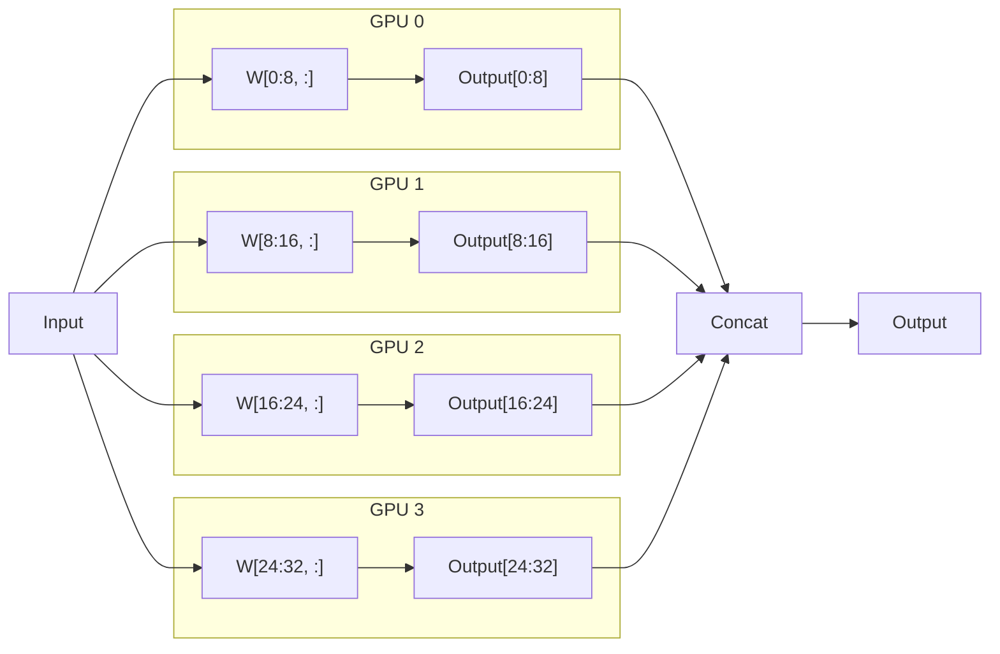

**层内切分 vs 层间切分：**

| 方式 | 原理 | 通信量 | 代表框架 |
|------|------|--------|----------|
| Tensor Parallelism | 单层权重切分到多个 GPU | 中高 | Megatron-LM |
| Pipeline Parallelism | 整个层分配到不同 GPU | 低 | GPipe |
| Data Parallelism | 完整模型复制多份 | 低 | 通用 |

**Mini-SGLang 中的实现：**
- **列并行**：权重按列切分，每个 GPU 计算部分输出，输出直接用于后续计算（如注意力计算），无需拼接（如 `LinearQKVMerged`）
- **行并行**：权重按行切分，输出通过 `all_reduce` 求和（如 `LinearOProj`）
- **词汇表并行**：嵌入层使用 `all_reduce`，LM 头使用 `all_gather`

### 8.2 通信后端实现

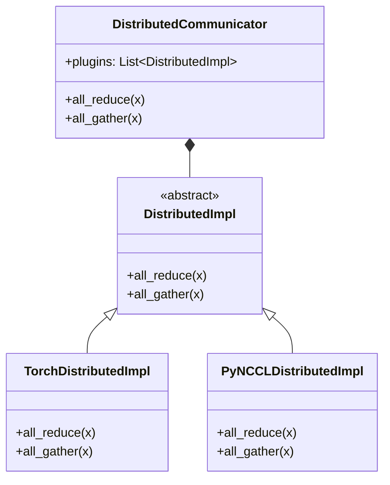

**两种后端的对比：**

| 特性 | TorchDistributedImpl | PyNCCLDistributedImpl |
|------|---------------------|----------------------|
| 通信后端 | gloo (CPU) / NCCL (GPU) | NCCL (GPU Direct) |
| 性能 | 较低 | 高 |
| 适用阶段 | 模型加载/初始化 | 推理计算 |
| 跨节点 | 支持 | 支持 |

### 8.3 PyNCCL 的 CUDA Direct 优化

PyNCCL 使用 CUDA Direct 技术，实现 GPU 之间的直接通信：

```
传统方式 (CPU 中转):
GPU 0 → 系统内存 (PCIe) → CPU → 系统内存 (PCIe) → GPU 1
           ↓                           ↓
          拷贝                       拷贝

CUDA Direct (零拷贝):

GPU Direct P2P (同节点):
┌───────┐                                         ┌───────┐
│ GPU 0 │ ←─────── NVLink / PCIe P2P ───────────→ │ GPU 1 │
└───────┘         (绕过 Host Memory)              └───────┘

GPU Direct RDMA (跨节点):
┌───────┐                                         ┌───────┐
│ GPU 0 │ ←─────── InfiniBand RDMA ─────────────→ │ GPU 1 │
└───────┘         (绕过双方 CPU)                  └───────┘
  Node A                                            Node B
```

**性能对比（示例数据）：**

| 指标 | 传统方式 | CUDA Direct |
|------|----------|-------------|
| 延迟 | ~10 μs | ~2 μs |
| 带宽 | 受限 | 接近理论值 |
| 内存占用 | 需 CPU 缓存 | 无额外占用 |

**硬件要求：**
- NVLink 连接或多节点 InfiniBand 网络
- GPU Direct RDMA 兼容的硬件

---

## 九、Tokenizer 与消息系统：进程间通信的秘密

Mini-SGLang 的多进程架构依赖于高效的进程间通信。在这个章节，我们将深入 ZMQ 消息协议的设计。

### 9.1 消息类型定义

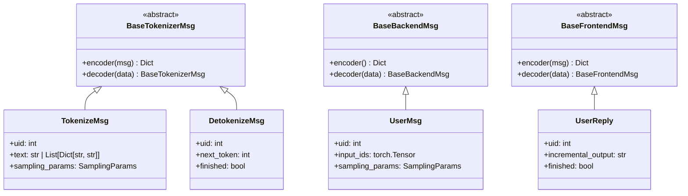

**完整消息类型列表：**

| 消息类型 | 基类 | 用途 | 关键字段 |
|----------|------|------|----------|
| `TokenizeMsg` | `BaseTokenizerMsg` | API → Tokenizer（文本→token IDs） | `uid`, `text`, `sampling_params` |
| `DetokenizeMsg` | `BaseTokenizerMsg` | Scheduler → Tokenizer（token→文本） | `uid`, `next_token`, `finished` |
| `AbortMsg` | `BaseTokenizerMsg` | API → Tokenizer（取消请求） | `uid` |
| `BatchTokenizerMsg` | `BaseTokenizerMsg` | 批量 Tokenizer 消息 | `messages` |
| `UserMsg` | `BaseBackendMsg` | Tokenizer → Scheduler（带参数请求） | `uid`, `input_ids`, `sampling_params` |
| `ExitMsg` | `BaseBackendMsg` | 退出信号 | - |
| `BatchBackendMsg` | `BaseBackendMsg` | 批量 Backend 消息 | `messages` |
| `UserReply` | `BaseFrontendMsg` | Tokenizer → API（流式响应） | `uid`, `incremental_output`, `finished` |
| `BatchFrontendMsg` | `BaseFrontendMsg` | 批量 Frontend 消息 | `messages` |

**消息类说明：**
- `BaseTokenizerMsg`：Tokenizer 相关消息基类
- `BaseBackendMsg`：Scheduler 相关消息基类  
- `BaseFrontendMsg`：API Server 相关消息基类
- 每个消息类都有序列化/反序列化方法

### 9.2 消息流详解

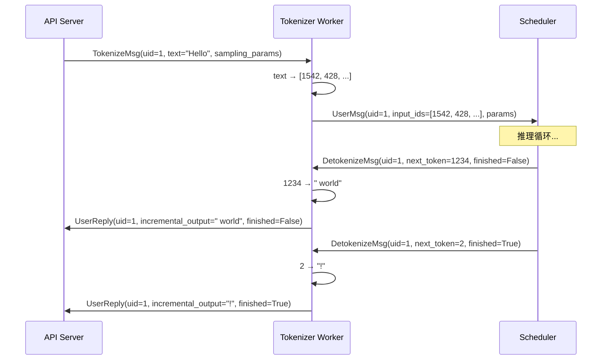

### 9.3 ZMQ 队列配置

```python
# 消息队列地址配置（带 PID 后缀避免进程间冲突）
# 实际地址格式: ipc:///tmp/minisgl_{编号}.pid={进程ID}

# zmq_backend_addr: Tokenizer → Scheduler (UserMsg)
# zmq_detokenizer_addr: Scheduler → Tokenizer (DetokenizeMsg)  
# zmq_scheduler_broadcast_addr: Rank 0 → 其他 ranks
# zmq_frontend_addr: Tokenizer → API (UserReply)
# zmq_tokenizer_addr: API → Tokenizer (TokenizeMsg)

# 具体实现（config.py）:
@property
def zmq_backend_addr(self) -> str:
    return "ipc:///tmp/minisgl_0" + self._unique_suffix

@property
def zmq_detokenizer_addr(self) -> str:
    return "ipc:///tmp/minisgl_1" + self._unique_suffix

@property
def zmq_scheduler_broadcast_addr(self) -> str:
    return "ipc:///tmp/minisgl_2" + self._unique_suffix

# 服务器端额外地址（server/args.py）:
@property
def zmq_frontend_addr(self) -> str:
    return "ipc:///tmp/minisgl_3" + self._unique_suffix

@property
def zmq_tokenizer_addr(self) -> str:
    if self.share_tokenizer:
        return self.zmq_detokenizer_addr
    result = "ipc:///tmp/minisgl_4" + self._unique_suffix
    assert result != self.zmq_detokenizer_addr
    return result
```

**地址设计原则：**
1. **IPC 协议**：使用 Unix Domain Socket，比 TCP 更高效
2. **PID 后缀**：避免多实例冲突
3. **可配置端口**：支持分布式部署
4. **命名规范**：清晰标识用途

---

## 十、总结：简洁但不简单的系统设计

### 10.1 架构亮点

我们可以学习 Mini-SGLang 的架构亮点：

**1. 清晰的模块边界**

每个模块都有明确的职责边界：
- Server：服务入口
- Scheduler：调度决策
- Engine：执行推理
- Attention：注意力计算
- KV Cache：存储管理
- ...

**2. 可插拔的设计**

关键组件都可以替换：
- 注意力后端（FlashAttention / FlashInfer）
- 缓存管理器（Radix / Naive）
- 分布式通信后端（gloo / NCCL）
- ...

**3. 系统性的性能优化**

不是单一的优化，而是系统性的优化组合，比如：
- Overlap Scheduling：CPU/GPU 重叠
- Chunked Prefill：避免长请求阻塞
- Radix Cache：前缀复用
- CUDA Graph：消除 Python 开销
- 异步拷贝：减少等待时间
- ...

**4. 代码的简洁可读性**

约 5000 行核心代码，使用纯 Python 实现：
- 易于学习
- 易于扩展
- 易于调试

### 10.2 结束语

Mini-SGLang 这个项目**简洁但不简单**。5000 行代码背后，是对推理系统的深刻理解和精心设计。

如果你正在学习 LLM 推理架构，Mini-SGLang 是一个绝佳的起点。

---

## 参考资源

**项目地址**: https://github.com/sgl-project/mini-sglang

**[SGLang: Efficient Execution of Structured Language Model Programs](https://arxiv.org/abs/2312.07104)**
- 作者: Lianmin Zheng, Liangsheng Yin, Zhiqiang Xie, et al. (UC Berkeley, Stanford)
- 发表: NeurIPS 2024
- 核心贡献: 提出 RadixAttention 实现前缀缓存复用；压缩有限状态机加速结构化输出
- GitHub: https://github.com/sgl-project/sglang

**[Efficient Memory Management for Large Language Model Serving with PagedAttention](https://arxiv.org/abs/2309.06180)**
- 作者: Woosuk Kwon, Zhuohan Li, Siyuan Zhuang, et al. (UC Berkeley)
- 发表: SOSP 2023
- 核心贡献: PagedAttention 算法，借鉴操作系统虚拟内存分页机制管理 KV Cache
- GitHub: https://github.com/vllm-project/vllm

**[FlashAttention: Fast and Memory-Efficient Exact Attention with IO-Awareness](https://arxiv.org/abs/2205.14135)**
- 作者: Tri Dao, Daniel Y. Fu, Stefano Ermon, et al. (Stanford)
- 发表: NeurIPS 2022
- 核心贡献: 分块（Tiling）技术减少 HBM/SRAM 之间的数据传输；精确注意力计算
- GitHub: https://github.com/Dao-AILab/flash-attention

**[FlashAttention-2: Faster Attention with Better Parallelism and Work Partitioning](https://arxiv.org/abs/2307.08691)**
- 作者: Tri Dao (Princeton)
- 发表: 2023
- 核心贡献: 优化并行策略和工作分配，相比 FlashAttention-1 提速约 2×

**[FlashInfer: Efficient and Customizable Attention Engine for LLM Inference Serving](https://arxiv.org/abs/2501.01005)**
- 作者: Zihao Ye, Lequn Chen, et al.
- 发表: MLSys 2025 (Best Paper Award)
- 核心贡献: Block-Sparse 格式存储 KV Cache；JIT 编译优化；负载均衡调度
- GitHub: https://github.com/flashinfer-ai/flashinfer

**[Orca: A Distributed Serving System for Transformer-Based Generative Models](https://www.usenix.org/conference/osdi22/presentation/yu)**
- 作者: Gyeong-In Yu, Joo Seong Jeong, et al. (Seoul National University)
- 发表: OSDI 2022
- 核心贡献: 首次提出 Iteration-Level Scheduling（迭代级调度）和 Continuous Batching 概念
- 相关博客：
[How continuous batching enables 23x throughput in LLM inference while reducing p50 latency](https://www.anyscale.com/blog/continuous-batching-llm-inference) - Anyscale Blog
[Orca (LLM Inference)](https://friendli.ai/blog/orca-llm-inference) - FriendliAI Blog

**[GQA: Training Generalized Multi-Query Transformer Models from Multi-Head Checkpoints](https://arxiv.org/abs/2305.13245)**
- 作者: Joshua Ainslie, James Lee-Thorp, et al. (Google Research)
- 发表: EMNLP 2023
- 核心贡献: MHA 与 MQA 的折中方案；将 Query 头分组共享 KV 头

**[RoFormer: Enhanced Transformer with Rotary Position Embedding](https://arxiv.org/abs/2104.09864)**
- 作者: Jianlin Su, Yu Lu, et al. (追一科技)
- 发表: 2021 (更新至 2023)
- 核心贡献: 旋转位置编码（RoPE），通过旋转矩阵编码绝对位置并融合相对位置信息；被 LLaMA 等主流模型采用

**[Megatron-LM: Training Multi-Billion Parameter Language Models Using Model Parallelism](https://arxiv.org/abs/1909.08053)**
- 作者: Mohammad Shoeybi, Mostofa Patwary, et al. (NVIDIA)
- 发表: 2020
- 核心贡献: Transformer 层内的张量并行（Tensor Parallelism）策略

**[Efficient Large-Scale Language Model Training on GPU Clusters Using Megatron-LM](https://arxiv.org/abs/2104.04473)**
- 作者: Deepak Narayanan, Mohammad Shoeybi, et al. (NVIDIA, Stanford)
- 发表: SC 2021
- 核心贡献: 结合张量并行、流水线并行、数据并行的 3D 并行策略
- GitHub: https://github.com/NVIDIA/Megatron-LM

**[Accelerating PyTorch with CUDA Graphs](https://pytorch.org/blog/accelerating-pytorch-with-cuda-graphs/)**
- 来源: PyTorch 官方博客
- 核心贡献: 通过图捕获消除 CPU 端 kernel launch 开销

**[Sarathi-Serve: Chunked Prefills for Efficient LLM Serving](https://arxiv.org/abs/2403.02310)**


---

*本文基于 Mini-SGLang 源码编写，技术实现可能随版本更新而变化，建议查阅最新源代码。